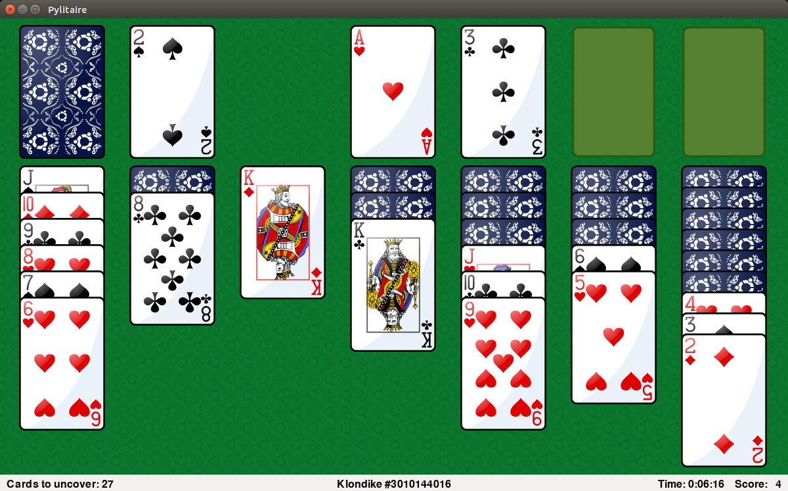

Pylitaire
=========

A Solitaire card game made in Python using Pygame

Rules are of [Yukon](http://en.wikipedia.org/wiki/Yukon_%28solitaire%29), which is very similar to the traditional Solitaire (also known as [Klondike](http://en.wikipedia.org/wiki/Klondike_solitaire)), but more challenging and (hopefully) more fun.

Humm, so I guess this project should be named *Pyukon* instead. Maybe I will :)

Reads the same card themes as [Gnome Aisleriot](https://wiki.gnome.org/action/show/Apps/Aisleriot) for a well-polished presentation, and it's easily customizable.



---

Requirements
------------

- [Python](https://www.python.org) 3.6+. Also tested in 3.7 and 3.8
- [Pygame](https://www.pygame.org) 2.1.2, the main game engine
- [Pillow](https://pillow.readthedocs.org), the modern fork of the Python Imaging Library
- [LibRsvg](https://wiki.gnome.org/Projects/LibRsvg), for SVG/SVGZ image format support
- [Pycairo](https://cairographics.org/pycairo), python and GIO bindings for Cairo, to bridge LibRsvg to Pygame.
- [PyXDG](https://www.freedesktop.org/wiki/Software/pyxdg), for platform-dependent user dirs.

The above can be installed in Debian-like distros (like Ubuntu/Mint) with:

	sudo apt install python3-{gi-cairo,pil,pygame,xdg} gir1.2-{gtk-3.0,rsvg-2.0}


Install and usage
-----------------

Clone the repository, install the dependencies, and run `pylitaire.sh` (`python3 -m pylitaire` works too!)

If using Python 3.7 or latter, you can also install with Pip:

	sudo apt install python3-{pip,gi-cairo} gir1.2-{gtk-3.0,rsvg-2.0}
	pip3 install .

And for desktop integration (icons and `.desktop` menu entry), run `install.sh`

---

Contributing
------------

Patches are welcome! Fork, hack, request pull! See the `TODO` file for a "roadmap" of priorities and most-wanted features.

If you find a bug or have any enhancement request, please to open a [new issue](https://github.com/MestreLion/pylitaire/issues/new)


Author
----------

Rodrigo Silva (MestreLion) <linux@rodrigosilva.com>


Licenses and Copyright
----------------------
```
Copyright (C) 2014 Rodrigo Silva (MestreLion) <linux@rodrigosilva.com>.
License GPLv3+: GNU GPL version 3 or later <http://gnu.org/licenses/gpl.html>.
This is free software: you are free to change and redistribute it.
There is NO WARRANTY, to the extent permitted by law.
```
